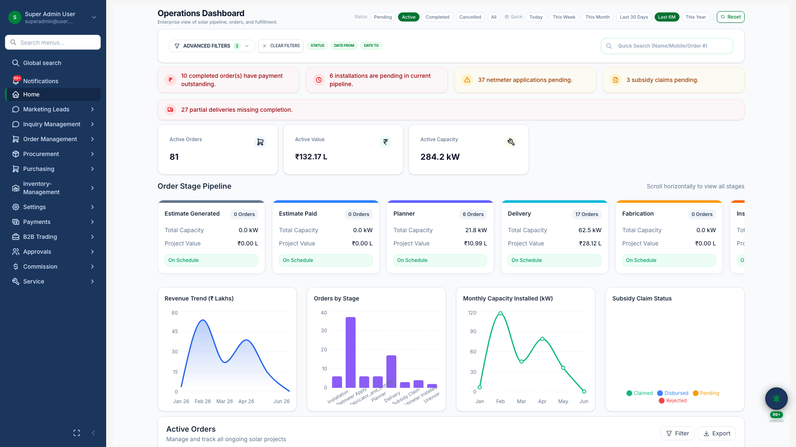

# Dashboard & Analytics

## Business Purpose

The home dashboard gives leadership and sales managers a real-time view of business performance — pipeline health, order activity, and key metrics — without running separate reports.

## What You Can Do

- View KPI summary cards for sales and operations
- Monitor the sales pipeline board by stage
- Review recent orders and their status
- Analyze trends over selectable time periods

## Who Uses It

| Role | Use |
|------|-----|
| Management | Daily business review |
| Sales managers | Team pipeline and conversion |
| Operations | Order backlog visibility |

## Screenshot

{.hero}

*Executive dashboard with KPIs, pipeline, and order activity.*
