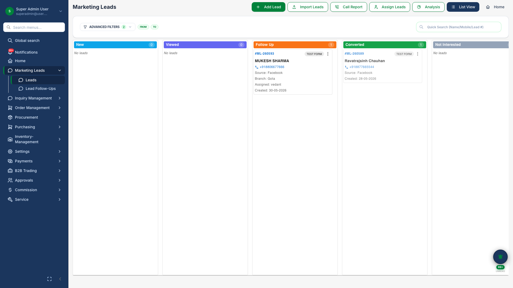
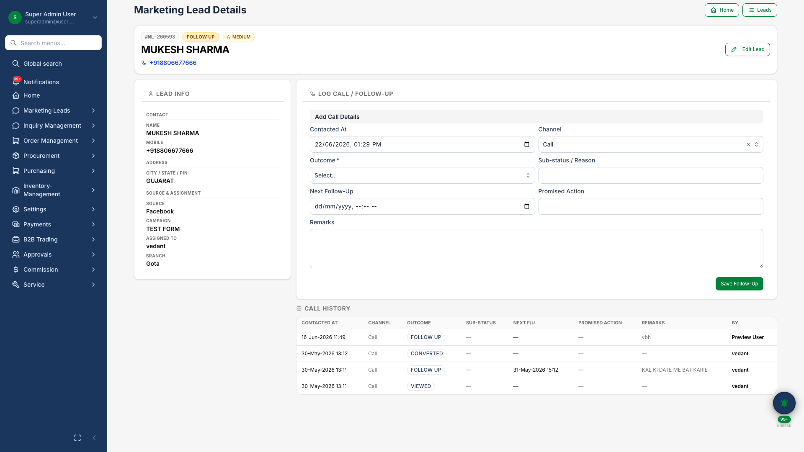

# Marketing Leads & Meta Integration

## Business Purpose

Capture and qualify digital marketing leads before they enter the formal sales pipeline. Meta Lead Ads integration brings Facebook and Instagram campaign leads directly into the system.

## What You Can Do

- Manage leads on a visual **kanban pipeline**
- View lead detail with call history and campaign source
- Assign leads to sales executives
- Import leads in bulk from spreadsheets
- Connect Meta Lead Ads for automatic lead sync

## How It Works

1. Lead arrives from Meta, upload, or manual entry
2. Team qualifies and records follow-up calls
3. Qualified lead converts to an **Inquiry**

## Screenshots

{.hero}

*Visual pipeline for marketing leads by stage.*

{.compact}

*Lead detail with contact info, source, and follow-up history.*
