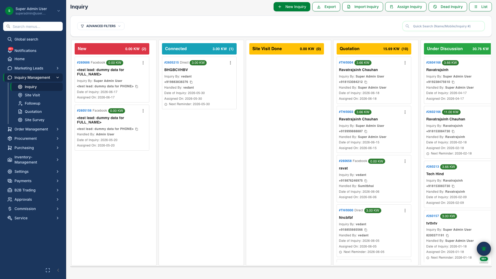
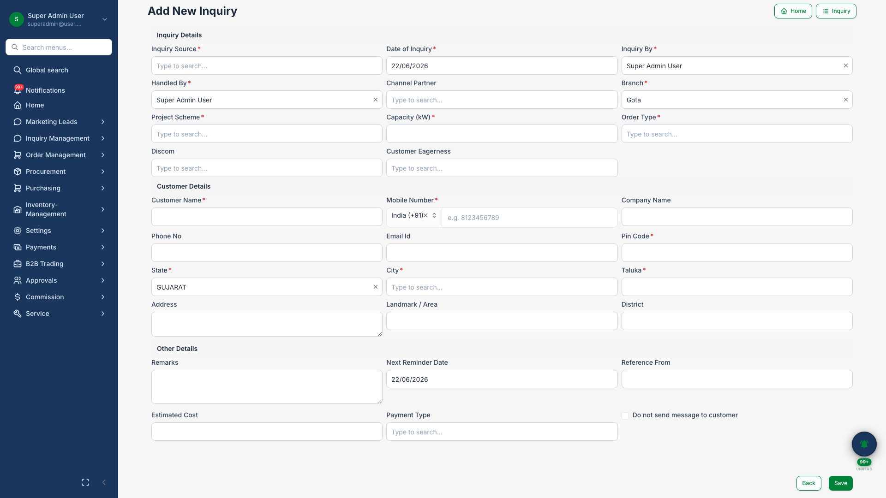
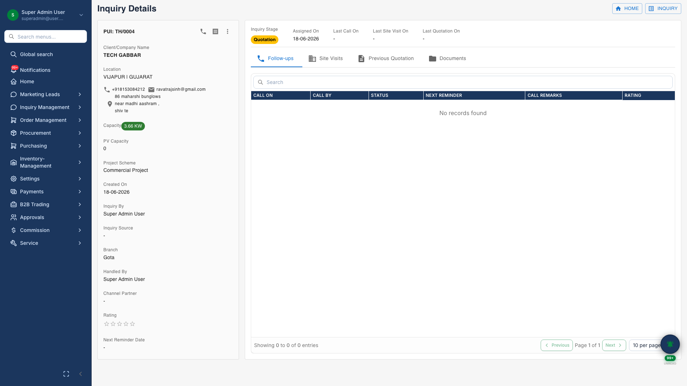

# Inquiry Management

## Business Purpose

Track sales opportunities from first contact through site assessment and qualification — the foundation of your solar sales pipeline.

## What You Can Do

- Manage inquiries on a **kanban board** by stage
- Create inquiries with customer, capacity, location, and DISCOM details
- Open inquiry **detail view** with follow-ups, site visits, documents, and quotations
- Schedule follow-up calls and site visits
- Convert qualified inquiries to quotations

## How It Works

1. Create inquiry or convert from marketing lead
2. Record follow-ups and site visit data
3. Attach supporting documents
4. Generate quotation when customer is ready

## Screenshots

{.hero}

*Stage-based inquiry pipeline.*

{.compact}

*New inquiry capture form with customer and project fields.*

{.compact}

*Inquiry hub with tabs for follow-ups, site visits, and documents.*
