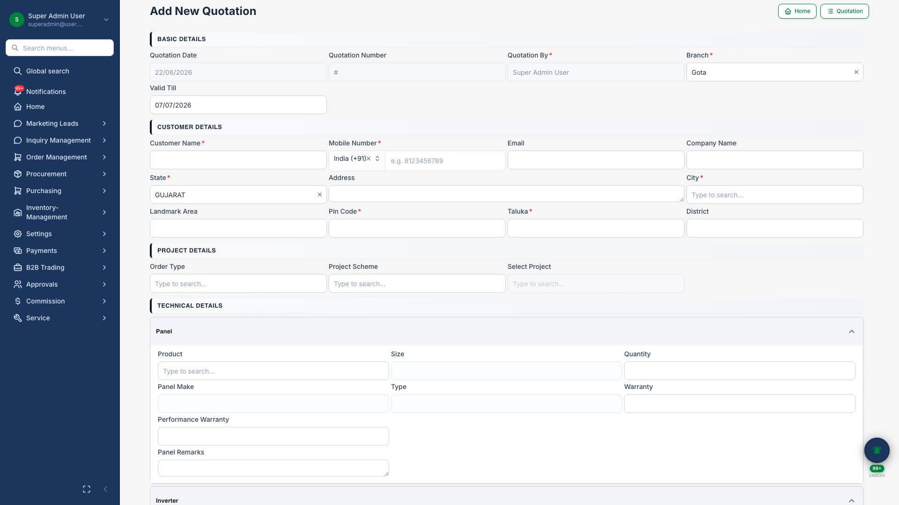
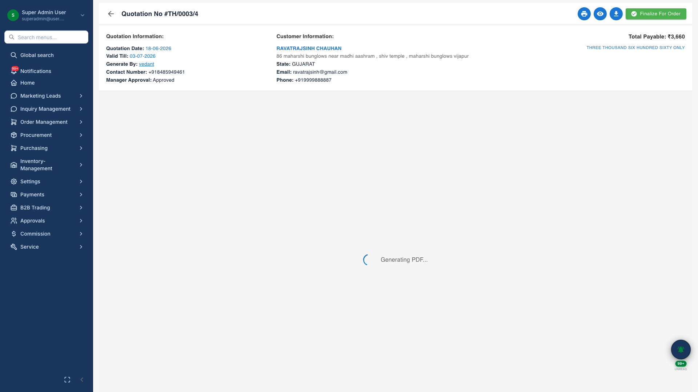
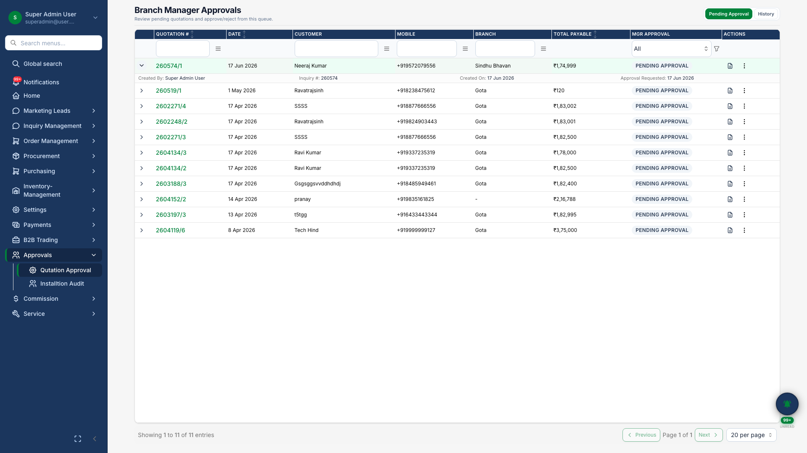

# Quotations

## Business Purpose

Create formal commercial proposals from qualified inquiries — with pricing, terms, manager approval, and customer-ready PDF output.

## What You Can Do

- Build quotations with product lines, discounts, and terms
- Submit for **manager approval** when required
- Preview and download **branded quotation PDF**
- Convert approved quotations to pending orders

## How It Works

1. Create quotation from inquiry
2. Add products and commercial terms
3. Manager reviews and approves
4. Share PDF with customer
5. Convert to order on acceptance

## Screenshots

{.hero}

*Quotation builder with technical and commercial sections.*

{.hero}

*Inline PDF preview of the approved quotation.*

{.compact}

*Manager approval queue with quotation detail sidebar.*
