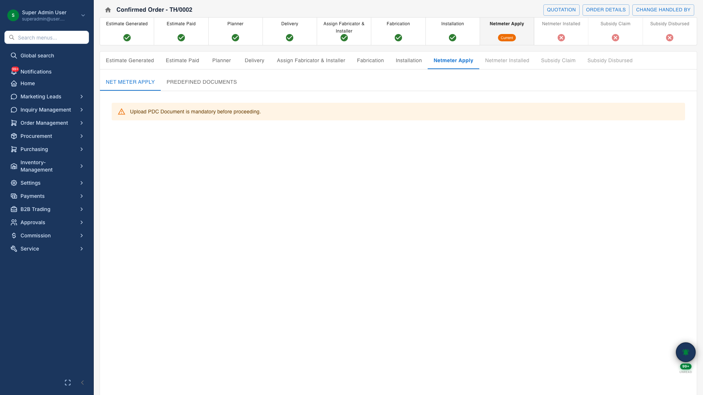
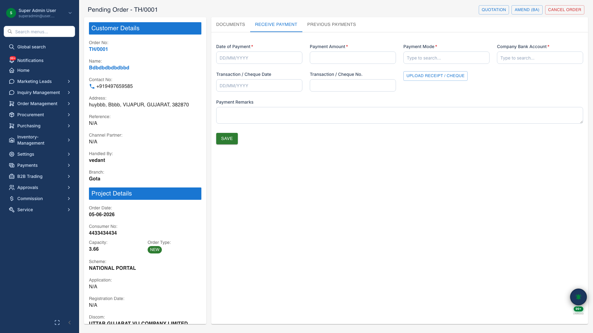
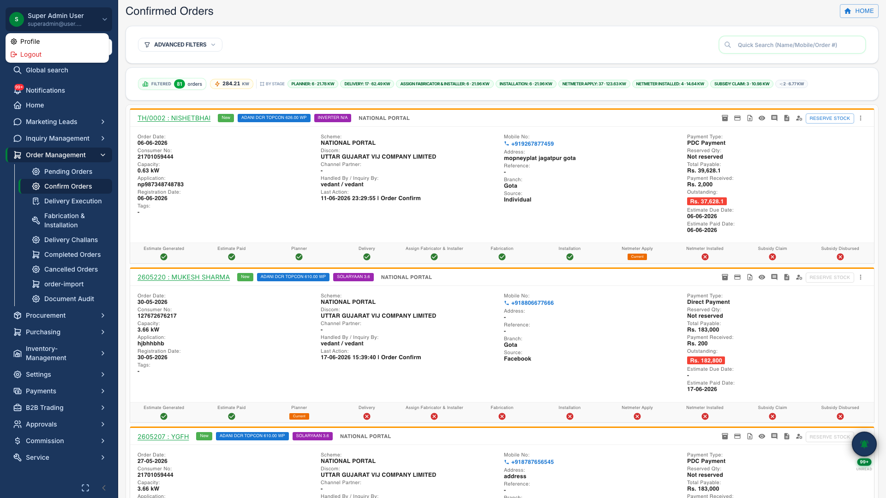

# Order Lifecycle

## Business Purpose

Manage the complete B2C project journey from pending order through confirmation, execution stages, payments, and closure.

## What You Can Do

- Create and confirm orders from approved quotations
- View **order pipeline** with stage tabs: registration, documents, payments, delivery, installation, subsidy
- Record payments against milestones
- Open **order detail drawer** for quick access from lists
- Track amendments and document collection

## How It Works

1. Quotation converts to pending order
2. Collect documents and confirm order
3. Progress through fabrication, delivery, and installation stages
4. Record payments and close project

## Screenshots

{.hero}

*Full project command center with lifecycle stages.*

{.compact}

*Delivery stage with challan management.*

{.compact}

*Installation tracking and serial capture.*

{.compact}

*Receive payment against order milestones.*

{.compact}

*Quick-view drawer for order summary from list.*
