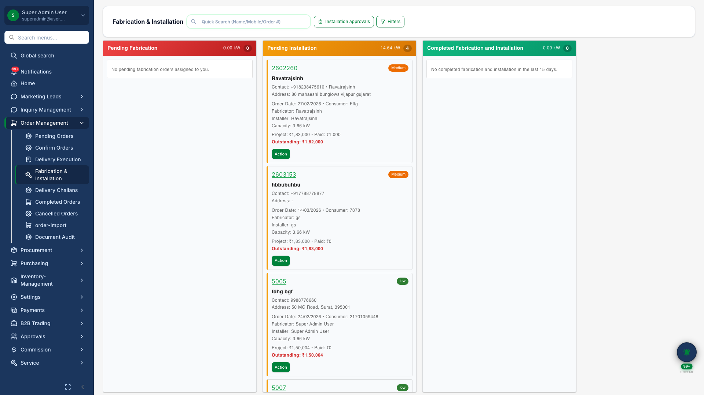
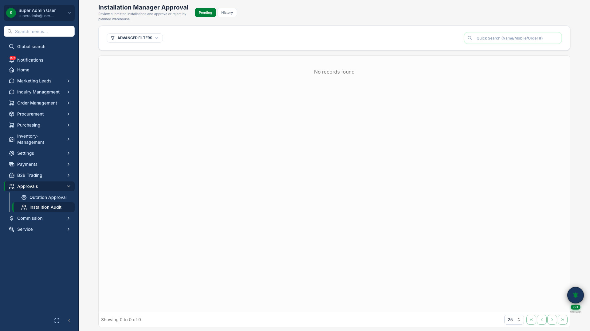
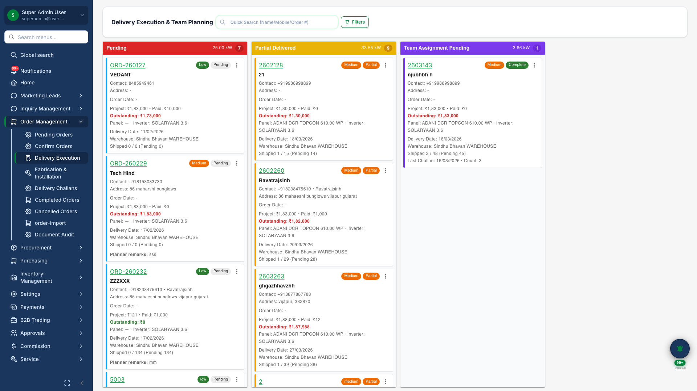
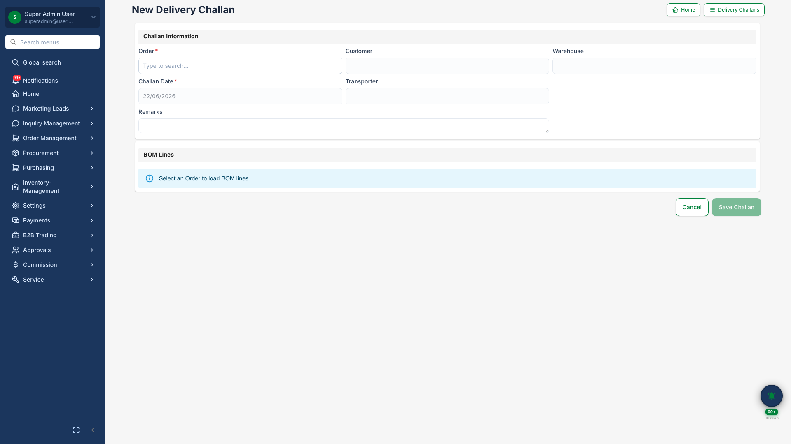

# Fabrication, Installation & Delivery

## Business Purpose

Coordinate field execution after order confirmation — shop fabrication, on-site installation, warehouse dispatch, and delivery proof.

## What You Can Do

- Track fabrication and installation on a **visual execution board**
- Manager **approves completed installations** via review drawer
- Manage delivery on a **kanban board** with order detail drawer
- Create **delivery challans** for material dispatch

## How It Works

1. Order enters fabrication queue
2. Installation team completes on-site work with serial numbers
3. Manager approves installation
4. Warehouse creates challan and confirms delivery

## Screenshots

{.hero}

*Fabrication and installation progress board.*

{.compact}

*Manager review drawer for installation sign-off.*

{.compact}

*Delivery kanban with order detail drawer.*

{.compact}

*New delivery challan creation.*
