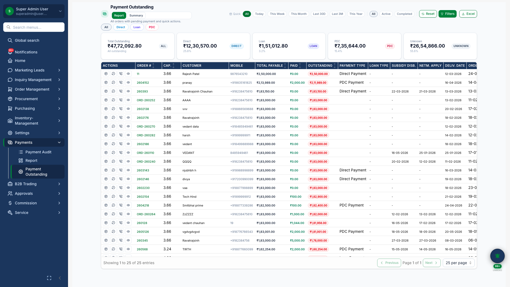
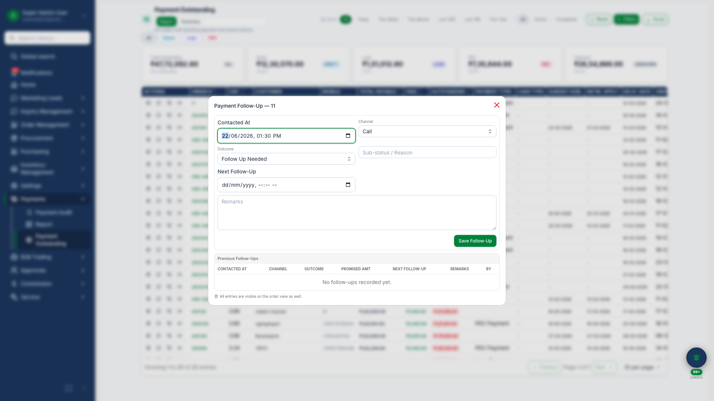
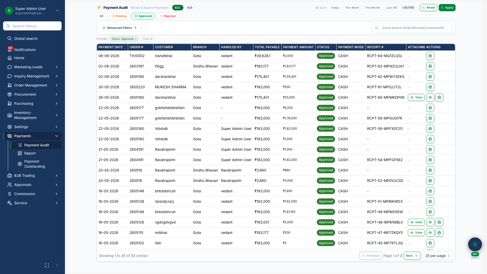

# Payments & Outstanding

## Business Purpose

Give finance teams clear visibility on receivables, collection follow-ups, and payment approvals across B2C projects.

## What You Can Do

- Monitor outstanding amounts with KPI summary
- Schedule and record **collection follow-ups** via dialog
- **Approve payment proofs** submitted by field teams
- Export outstanding data for reporting

## How It Works

1. Payments link to order milestones at confirmation
2. Finance tracks outstanding by age and customer
3. Follow-up calls are scheduled and recorded
4. Payment proofs are reviewed and approved

## Screenshots

{.hero}

*Outstanding dashboard with collection KPIs.*

{.compact}

*Collection follow-up scheduling dialog.*

{.compact}

*Payment proof approval workflow.*
