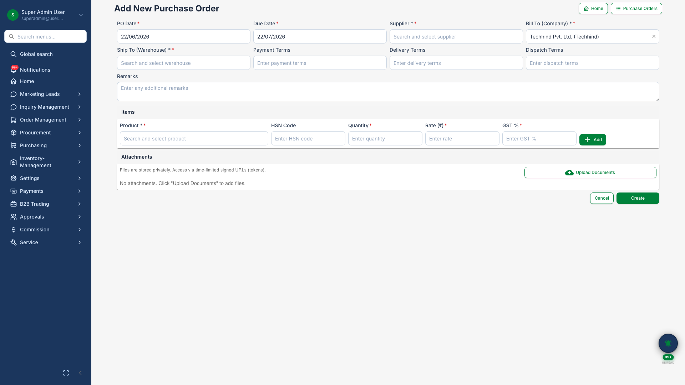
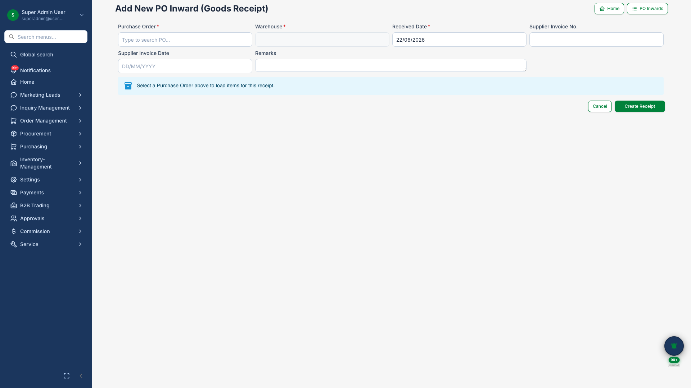
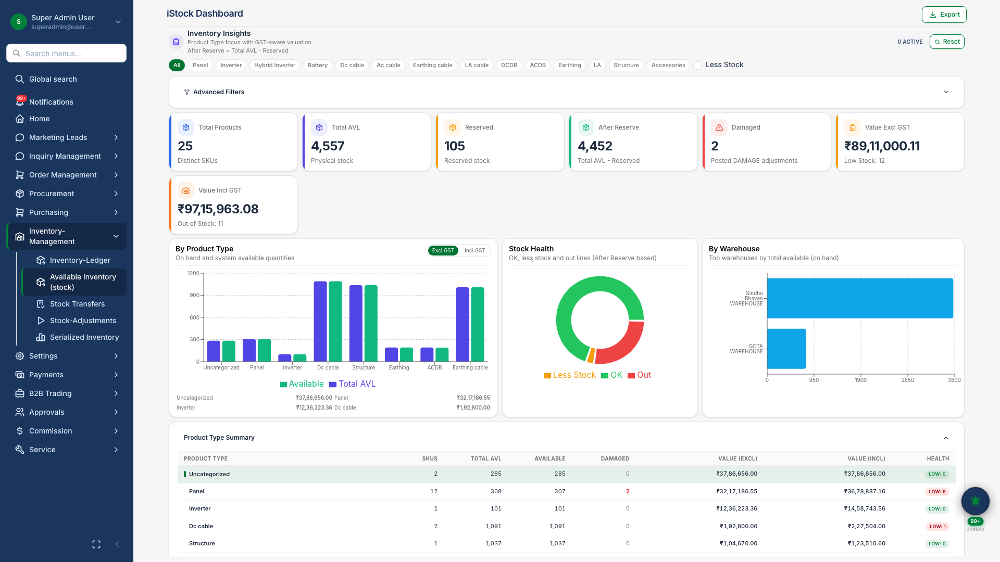

# Procurement & Inventory

## Business Purpose

Manage solar component supply — from purchase orders and goods receipt through stock levels and serial number tracking.

## What You Can Do

- Create **purchase orders** with line items and supplier terms
- Record **goods receipt** against POs with serial capture
- View current **stock levels** by warehouse and product
- Track serialized inventory for panels and inverters

## How It Works

1. Raise purchase order to supplier
2. Receive goods and update stock
3. Serial numbers registered at inward
4. Stock reserved and issued against orders and challans

## Screenshots

{.hero}

*Purchase order creation with product lines.*

{.compact}

*Goods receipt against purchase order.*

{.compact}

*Current stock levels by warehouse.*
