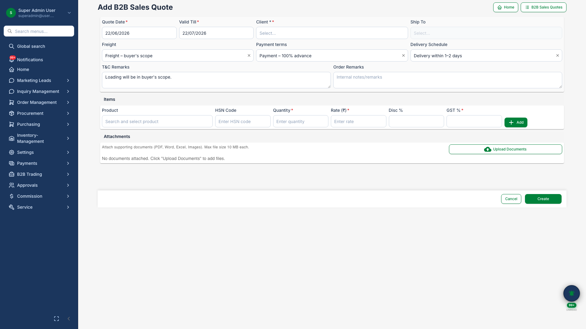
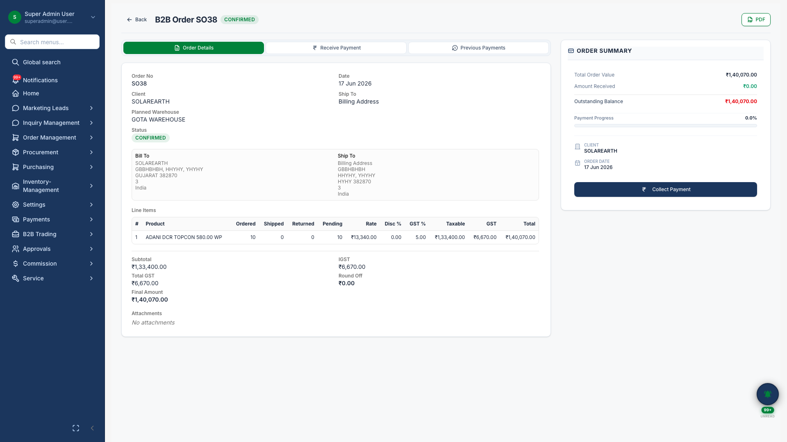
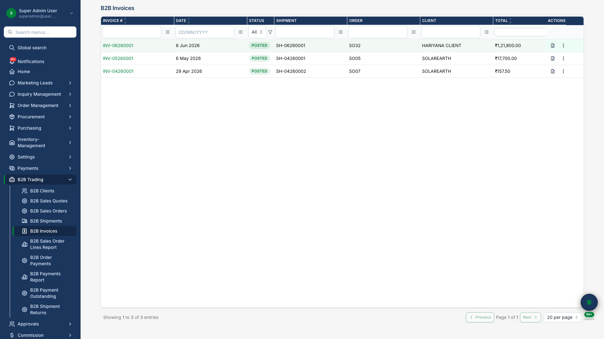

# B2B Trading

## Business Purpose

Support dealer and distributor sales — quotes, orders, shipments, and invoicing — separate from residential B2C projects.

## What You Can Do

- Create **B2B sales quotes** with GST line items
- Manage **sales orders** with payment tracking
- View **invoice detail** in sidebar with line items and client info
- Track B2B outstanding payments

## How It Works

1. Create quote for B2B client
2. Convert to sales order and confirm
3. Ship against order with serial tracking
4. Generate invoice and record payment

## Screenshots

{.hero}

*B2B quotation builder.*

{.compact}

*B2B sales order with payment tabs.*

{.compact}

*Invoice detail sidebar with line items.*
