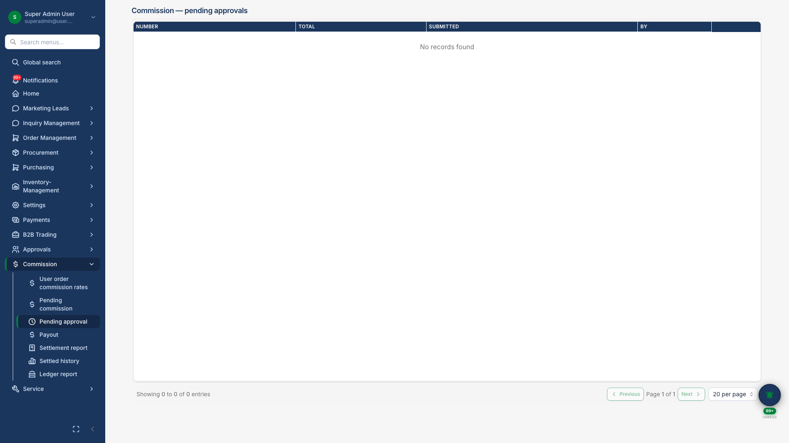

# Commission Management

## Business Purpose

Automate sales partner and channel incentive tracking — from accrual through manager approval to payout.

## What You Can Do

- Configure commission rates per user
- Review **pending settlements** in approval drawer
- Process payouts and view settlement history

## How It Works

1. Orders generate commission accruals
2. Finance batches unsettled entries
3. Manager approves in review drawer
4. Payout recorded and archived

## Screenshot

{.hero}

*Settlement approval drawer with order-level commission detail.*
