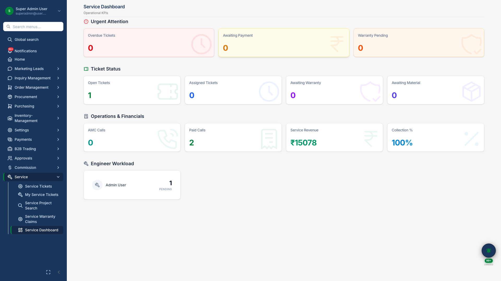
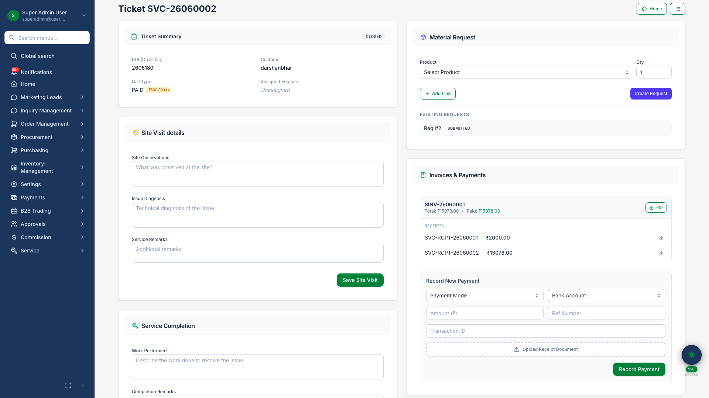

# Service & Warranty

## Business Purpose

Handle after-sales support for installed projects — service tickets, warranty claims, and field material requests linked to original order data.

## What You Can Do

- Monitor service workload on **operations dashboard**
- Manage tickets with assignment, site visits, and resolution
- Open **ticket detail** with full lifecycle and customer context
- Process warranty claims

## How It Works

1. Customer issue raised as service ticket
2. Ticket assigned to technician with priority
3. Site visit and materials if needed
4. Ticket closed; warranty claim if applicable

## Screenshots

{.hero}

*Service operations KPIs and workload.*

{.compact}

*Service ticket with customer, order, and resolution history.*
