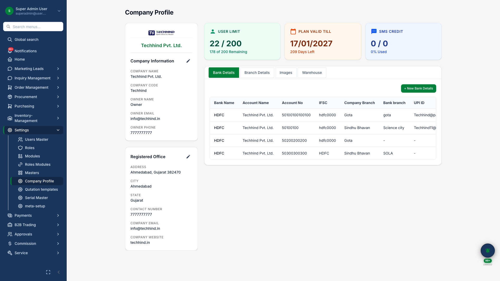

# Settings & Administration

## Business Purpose

Configure your organization in the platform — company details, branches, warehouses, bank accounts, users, roles, and reference data.

## What You Can Do

- Set up **company profile** with logo, branches, and warehouses
- Manage users and assign roles
- Configure which modules each role can access
- Maintain reference masters (DISCOM, payment modes, document types, etc.)

## How It Works

1. Admin sets company profile and branches
2. Roles defined for job functions
3. Module permissions assigned per role
4. Users created and linked to roles and branches

## Screenshot

{.hero}

*Organization setup with company, branches, warehouses, and bank accounts.*
